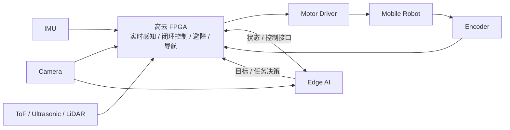

# HITSZ-FPGA-FALCONS · Embodied Robot

> 2026 全国大学生嵌入式芯片与系统设计竞赛 FPGA 创新设计赛道  
> 高云半导体题3：基于 FPGA 的具身智能机器人实时感知与自主控制系统设计

## 项目定位

本项目面向具身智能机器人的实时感知与自主控制需求，拟以高云 FPGA 为实时控制核心，完成摄像头、IMU、编码器及测距传感器等多源信息的实时采集与处理，实现编码器反馈的闭环运动控制、障碍物检测与实时避障，以及起点—终点和路径点自主导航。在此基础上构建 FPGA 与边缘 AI 协同架构，由 FPGA 承担低时延、确定性的感知与控制链路，边缘计算平台负责目标识别、跟踪及高层任务决策，进一步完成面向具体场景的自主任务执行。

## 设计原则

1. **FPGA 是实时核心，不是外设。**
2. **基础任务与稳定性优先于 AI 扩展。**
3. **先形成可运行闭环，再增加复杂度。**
4. **模块先仿真、后上板、再集成。**
5. **官方例程与成熟开源项目优先 Fork，不直接复制后失去上游历史。**
6. **主仓库只保留最终作品真正需要的代码、配置、文档与集成接口。**

## 系统架构



## 当前阶段

当前目标不是一次性完成完整机器人，而是尽快建立最小可运行链路：

```text
Verilog 基础
→ Gowin 工具链 / 开发板
→ PWM / 编码器
→ 单电机闭环
→ 双轮差速底盘
→ IMU / 测距
→ 实时避障
→ 自主导航
→ 摄像头
→ 边缘 AI 扩展
```

## 仓库结构

```text
.
├─ fpga/
│  ├─ rtl/          # 可综合 RTL
│  ├─ tb/           # Testbench
│  ├─ constraints/  # 引脚 / 时序约束
│  ├─ ip/           # 本项目使用的 IP 配置说明
│  └─ scripts/      # 构建、仿真、辅助脚本
├─ edge_ai/         # 与最终机器人集成相关的边缘 AI 代码
├─ hardware/        # BOM、接线、机械、电源、板卡说明
├─ docs/
│  ├─ architecture/ # 系统与接口设计
│  ├─ test/         # 测试记录与实测数据
│  └─ meeting/      # 关键会议决策
├─ tools/           # 串口、数据分析、转换等辅助工具
├─ tests/           # 跨模块 / 系统级测试
├─ demo/            # 可复现演示脚本、说明
└─ .github/         # Issue / PR 模板
```

## 多仓库原则

`HITSZ-FPGA-FALCONS` 是团队级 Organization，不要求所有内容都塞进本仓库。

适合独立仓库的内容：

- 官方开发板例程 Fork；
- 第三方开源项目 Fork；
- 独立验证性质的 FPGA 小实验；
- 与主项目解耦的 AI 训练工程；
- 后续可以独立复用的工具。

主仓库负责回答一个问题：

> **最终参赛作品如何从源码、硬件、模型与文档被完整复现和解释？**

如果外部仓库成为最终系统依赖，在本 README 中加入固定链接、版本/commit 与用途，不建议初期使用 Git submodule 增加协作复杂度。

## 协作规则

详细见 [CONTRIBUTING.md](CONTRIBUTING.md) 与 [docs/TEAM_WORKFLOW.md](docs/TEAM_WORKFLOW.md)。

核心规则：

- `main` 必须尽量保持可运行、可演示；
- 功能开发使用短生命周期分支；
- 一个 Issue 对应一个清晰交付物；
- FPGA 核心模块至少由另一名队员看过接口与波形；
- 禁止把“在我电脑上能跑”当作完成；
- 任何关键硬件改动都记录接线、版本和测试结果。

## 分支命名

```text
feat/<module-or-function>
fix/<problem>
exp/<experiment>
docs/<topic>
chore/<maintenance>
```

例如：

```text
feat/encoder-counter
feat/motor-pid
exp/camera-color-tracking
fix/uart-frame-loss
docs/system-architecture
```

## Commit 约定

建议使用简洁的 Conventional Commits 风格：

```text
feat(fpga): add quadrature encoder counter
fix(control): clamp pwm output at low speed
test(fpga): add encoder counter testbench
docs(arch): update fpga-edge interface
chore(repo): add issue templates
```

## Issue 工作流

推荐看板：

```text
Backlog → Ready → In Progress → Review / Verify → Done
```

推荐标签：

```text
area:fpga
area:control
area:sensor
area:vision
area:ai
area:hardware
area:docs

type:task
type:bug
type:experiment

priority:P0
priority:P1
priority:P2

status:blocking
```

## Demo Gate

每个阶段都应有可验证的“过关条件”，例如：

- PWM：示波器/逻辑分析仪可验证频率与占空比；
- 编码器：方向、计数、速度估计正确；
- 单电机闭环：阶跃响应可记录；
- 双轮底盘：直行、转向、原地旋转稳定；
- 避障：规定距离内可稳定减速/停车；
- 导航：可重复完成起点—终点或路径点；
- AI：目标识别/跟踪结果能够转化为明确的高层指令；
- 系统：AI 异常时底层安全控制仍保持有效。

## License 与第三方代码

不要把来历不明的代码直接复制进主仓库。

使用第三方代码时应记录：

- 上游仓库；
- License；
- 使用的 tag / commit；
- 修改内容；
- 在本项目中的用途。

相关记录统一放入 `docs/UPSTREAM.md`。
