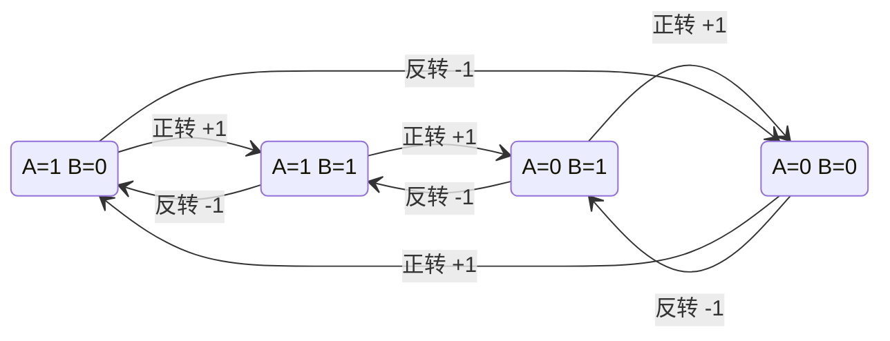

# encoder_counter — 正交编码器计数器（4 倍频）

> 遵循 `.claude/skills/shared/ModuleDocContract.md`。
> 目标：**不读 RTL 也能实例化、驱动、推理这个模块。**
>
> 源文件：`fpga/rtl/encoder_counter.v` · Testbench：`fpga/tb/tb_encoder_counter.sv`

---

## 1. Module Overview

把正交编码器的 A/B 两相方波，转换成"走了多少格"的位置计数，并给出每个采样周期内的位置增量。

每个 A/B 边沿计一格（**4 倍频**），正转（A 领先 B 90°）`pos` 增加，反转减少。
是电机闭环控制里"测速"那一环的输入端：`encoder_counter` → `odom`/`pid_ctrl` → `pwm_gen`。

---

## 2. Parameters

| Parameter | Default | Legal Range | Description |
|---|---|---|---|
| `POS_W` | 32 | ≥ 2 | 位置计数器位宽（位） |
| `VEL_W` | 16 | ≤ POS_W | 速度输出位宽（位） |
| `RS_LV` | 0 | 0 / 1 | 复位有效电平。0 = 低有效（项目默认） |

**跨参数约束**：`VEL_W <= POS_W`。`vel` 取位置增量（`pos - vel_base`）的低 `VEL_W` 位，
所以 `VEL_W` 必须放得下一个采样周期内的最大增量。当前默认值下安全裕量很大
（20 ms @ 500 线 × 4 倍频 × 5 转/s ≈ 200 ≪ 2^15）。

> **编码器线数不是本模块的参数。** 本模块只输出**格数**（count），
> 换算成 mm 或 rad 是上层 `odom` 的事。这样同一份 RTL 换编码器不用改。

---

## 3. Ports

| Name | Direction | Width | Reset Value | Description |
|---|---|---|---|---|
| `clk` | input | 1 | — | 系统时钟（板上 50 MHz） |
| `rst_n` | input | 1 | — | 复位，**极性由 `RS_LV` 决定**（名里的 `_n` 是固定命名，不代表极性） |
| `enc_a` | input | 1 | — | 编码器 A 相。**异步输入**，模块内部打两拍同步 |
| `enc_b` | input | 1 | — | 编码器 B 相。同上 |
| `clr` | input | 1 | — | **单周期脉冲**：位置清零，同时把测速基准归零 |
| `tick` | input | 1 | — | **单周期脉冲**：测速采样使能 |
| `pos` | output | `POS_W` | `0` | 累计位置（count）。**二补码有符号**，反转时为负 |
| `vel` | output | `VEL_W` | `0` | 上一个采样周期内的位置增量（count/采样周期）。**二补码有符号** |

---

## 4. Interface Protocol

**无握手总线。** 全部是独立信号：`enc_a`/`enc_b` 是被动采样，
`clr`/`tick` 是单周期脉冲，`pos`/`vel` 是持续有效的寄存器输出。

驱动规则：

- `clr` 与 `tick` **必须是单周期脉冲**（高一个 `clk` 周期）。持续拉高不会更有效，
  只会让每次采样都被跳过。
- 两个脉冲**可以同时来**，此时 `clr` 优先，该次 `tick` 采样被丢弃（见 §10）。
- `clr` / `tick` 由外部产生（通常来自 `clk_div` 的 `tick` 输出）。
  **本模块不自己产生时间基准**——这样全设计只有一个时钟域。

### 时序示例（正转 2 格后打一次 tick）

| Cycle | `enc_a` | `enc_b` | `clr` | `tick` | `pos` | `vel` | 说明 |
|---|---|---|---|---|---|---|---|
| 0 | 1 | 0 | 0 | 0 | 0 | 0 | 初始 |
| 1 | 1 | 1 | 0 | 0 | 0 | 0 | A/B 已变，等同步链 |
| 2 | 1 | 1 | 0 | 0 | 0 | 0 | 同步第 2 拍 |
| 3 | 1 | 1 | 0 | 0 | 1 | 0 | **译码出边沿 → pos 加 1** |
| 4 | 0 | 1 | 0 | 0 | 1 | 0 | |
| 5 | 0 | 1 | 0 | 0 | 1 | 0 | |
| 6 | 0 | 1 | 0 | 0 | 2 | 0 | **第二个边沿 → pos 加 1** |
| 7 | 0 | 1 | 0 | **1** | 2 | 0 | tick 采样 |
| 8 | 0 | 1 | 0 | 0 | 2 | **2** | `vel` = 2 − 0 = 2 |

对应 tb 用例 `[8]`（正转 6 步 → `vel == 6`）。

---

## 5. Reset Behavior

- **同步复位**（`always @(posedge clk)`，无 `negedge`）。
- 有效电平由 `RS_LV` 决定，判据是 **`rst_n == RS_LV`**——**不是**硬编码的 `!rst_n`。
  默认 `RS_LV = 0`（低有效）。
- 复位时：`pos <= 0`、`vel <= 0`、内部同步器与 `enc_prev_ff`、`vel_base_ff` 全部清零。
  与 §3 的 Reset Value 列一致。

> ⚠️ **已知副作用**：复位把两相同步器清成 `00`。若复位释放那一刻编码器**实际停在
> `01`/`10`/`11`**，译码会把 `00 → 实际值` 当成一次真实跳变，**多算 ±1 格**。
> 这是有意取舍（换来确定的复位态）。解决办法见 §10。

---

## 6. Timing Characteristics

| 项 | 值 |
|---|---|
| 时钟域 | **单时钟域**（`clk`）。无 CDC 边界——异步输入已在模块内部同步 |
| 引脚变化 → `pos` 更新 | **3 个 `clk` 周期**（同步器 2 拍 + 译码比较 1 拍） |
| `tick` → `vel` 更新 | **1 个 `clk` 周期** |
| `clr` → `pos` 归零 | **1 个 `clk` 周期** |
| 吞吐 | 每个 `clk` 最多一次计数；无流水线 |
| 最高计数率 | 同步器是 2 拍，所以 A/B 的边沿间隔必须 ≳ 3 个 `clk`（50 MHz 下 ≈ 60 ns） |

> ⚠️ **`pos` 不是"立刻"变的**，晚 3 拍。写 `pid_ctrl` 时若用 `pos` 的差分算速度，
> 这 3 拍是固定延迟，不影响结果；但**不要**在同一个 `clk` 里写完 `enc_a` 就读 `pos` 期望它变了。

---

## 7. Functional Description

模块分三级，每级一个 `always` 块：

1. **同步**：`enc_a` / `enc_b` 各过一个两级同步器（2FF）。取第二级作为"干净的"输入。
   这一步把板外长线带来的毛刺和亚稳态挡在状态机外面。
2. **译码**：把 `(上次A, 上次B, 这次A, 这次B)` 拼成 4 位码，用查找表定方向，`pos` 加/减 1。
3. **测速**：`tick` 到来时，`vel = pos − 上次采样时的 pos`，并更新采样基准。

**"四倍频"的意思**：一个完整电气周期里 A 有 2 个边沿、B 有 2 个边沿，共 4 个。
每个边沿计一格，所以分辨率是编码器线数的 **4 倍**——
500 线的编码器转一圈是 **2000 格**，不是 500。

---

## 8. Algorithm

方向译码是一个 **4 状态格雷码循环**，不需要 FSM：



**任何"跳两格以上"的转移（如 `00 → 11`）都不在图上，一律不计数。**

---

## 9. Register Map

不适用。本模块不暴露 CPU 可访问寄存器。

---

## 10. Usage Constraints

### 10.1 启动后建议先 `clr` 一次

复位副作用（§5）可能带来 ±1 格的初始偏移。若应用在意绝对位置：

```
复位释放 → 等 ≥ 3 个 clk（让同步链收敛）→ 打一次 clr → 此后 pos 从 0 起算
```

`clr` **同时会把测速基准归零**，所以 `clr` 之后第一个 `vel` 一定是干净的 0 起步。
（若不做这一步，复位后第一次 `tick` 的 `vel` 会包含那 ±1 的偏移。）

### 10.2 `clr` 与 `tick` 同拍时，`clr` 优先

该次 `tick` 采样被丢弃，`vel` 保持旧值。如果应用在同一拍同时产生这两个脉冲，
要知道会**少一次采样**。正常情况下两者不该同拍。

### 10.3 `clr` 之后第一个采样周期可能是"半截"的

`clr` 什么时候来不由本模块控制。如果它落在采样周期中间，
下一个 `tick` 测到的增量只覆盖半个周期 → **`vel` 偏小**。

> **建议**：`clr` 之后丢弃第一个 `vel` 读数。或者让产生 `tick` 的模块在 `clr` 后
> 重新对齐周期。

### 10.4 A/B 的电平与极性

- **输入电平必须 ≤ 3.3 V。** 5 V 编码器直连会打坏 FPGA IO（见 `hardware/接线表.md` §1）。
- **方向约定**：A 领先 B 90° = `pos` 增加。若实物装反，两种处理都行——
  交换 A/B 接线，或在上层对 `pos`/`vel` 取负。**不要改本模块的译码表**，
  那会让这份文档和 RTL 对不上。

### 10.5 计数上限

`pos` 是 `POS_W` 位有符号，**回绕是静默的**（二补码自然回绕，不报错）。
默认 `POS_W=32` 在 4 倍频 2000 格/圈下是 100 万圈以上，实际不会碰到。
`vel` 同理，`VEL_W` 不够时截断低 `VEL_W` 位。

---

## 11. Instantiation Template

```verilog
encoder_counter #(
    .POS_W (32),
    .VEL_W (16),
    .RS_LV (0)
) u_enc_left (
    .clk   (clk),
    .rst_n (rst_n),
    .enc_a (enc_a[0]),
    .enc_b (enc_b[0]),
    .clr   (enc_clr),
    .tick  (tick_20ms),
    .pos   (/* [POS_W-1:0] out */),
    .vel   (/* [VEL_W-1:0] out */)
);
```

---

## 附：验证记录

| 项 | 值 |
|---|---|
| **被验证的 commit** | `c036907`（RTL + TB 所在提交） |
| 仿真器 | iverilog **v12.0**（`C:\iverilog\bin\`），`-g2012` |
| 日期 | 2026-09-25 笔记本侧 |
| 命令 | `iverilog -g2012 -o sim.out fpga/tb/tb_encoder_counter.sv fpga/rtl/encoder_counter.v && vvp sim.out` |
| 结果 | **PASS**，12 项检查全过 |
| 反向验证 | 三个变异体全部被抓：方向取反 → 6 项 FAIL；去掉 `clr` → 10 项 FAIL；`default` 也计数 → 10 项 FAIL |
| 综合 | ⬜ 未做（笔记本无 Gowin 授权） |
| 上板 | ⬜ 未做 |

> **为什么必须写 commit**：09-20 出过一次事故——台式机报过 `pwm_gen` 的 PASS，
> 但没记 commit，事后发现跑的是旧版本，**那个 PASS 什么也没证明**。
> 跑一遍 + 记 commit，缺一不可。

> **反向验证的意义**：证明这个 testbench 在模块真的错了时会报 FAIL。
> 一个永远不报 FAIL 的 testbench，和没有 testbench 是一回事。
