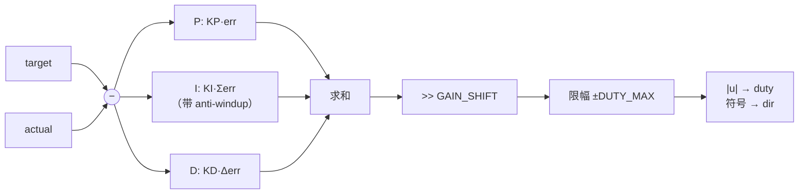

# pid_ctrl — 单侧轮速 PID 控制器

> 遵循 `.claude/skills/shared/ModuleDocContract.md`。
> 源文件：`fpga/rtl/pid_ctrl.v` · Testbench：`fpga/tb/tb_pid_ctrl.sv`

---

## 1. Module Overview

每个控制周期比较"目标速度"和"实测速度"，用 PID 算出一个 PWM 占空比与方向。

它补上了主链路的最后一环：`encoder_counter` 测速度 → **`pid_ctrl` 算控制量** →
`pwm_gen` 驱动电机 → 回到编码器。**四轮差速的一侧一份**（左右各一个实例）。

---

## 2. Parameters

| Parameter | Default | Legal Range | Description |
|---|---|---|---|
| `DUTY_W` | 12 | ≥ 1 | duty 输出位宽 |
| `DUTY_MAX` | 2500 | < 2^`DUTY_W` | duty 上限，**必须等于 `pwm_gen` 的 PERIOD** |
| `GAIN_SHIFT` | 8 | ≥ 0 | 增益定点位数。实际增益 = 参数值 / 2^`GAIN_SHIFT` |
| `KP` | 256 | ≥ 0 | 比例增益（Q8：256/256 = **1.0**） |
| `KI` | 32 | ≥ 0 | 积分增益（Q8：32/256 = **0.125**） |
| `KD` | 0 | ≥ 0 | 微分增益（Q8）。**默认 0 = 关掉**，见 §10.4 |
| `ACC_MAX` | 200000 | > 0 | 积分累加限幅 |
| `RS_LV` | 0 | 0 / 1 | 复位有效电平，0 = 低有效 |

**跨参数约束**：
- `DUTY_MAX < 2^DUTY_W`（否则限幅值本身就会溢出）
- `DUTY_MAX` 必须与 `pwm_gen` 的 `PERIOD` 一致，否则占空比比例不对

> ⚠️ **默认增益是在 TB 的一阶电机模型上调出来的，不是真车参数。**
> 真车必须重新整定（见 §10.3）。TB 直接用默认值跑，所以**默认值本身也是被验证过的**。

---

## 3. Ports

| Name | Direction | Width | Reset Value | Description |
|---|---|---|---|---|
| `clk` | input | 1 | — | 系统时钟 |
| `rst_n` | input | 1 | — | 复位，极性由 `RS_LV` 决定 |
| `en` | input | 1 | — | 0 = 清零积分并输出 0 |
| `tick` | input | 1 | — | **控制周期使能**（约定 20 ms / 50 Hz） |
| `target` | input | `signed [15:0]` | — | 目标速度 mm/s（可负 = 倒车） |
| `actual` | input | `signed [15:0]` | — | 实测速度 mm/s（来自 `encoder_counter` + 换算） |
| `duty` | output | `[DUTY_W-1:0]` | `0` | PWM 占空比，**恒为非负**（0 ~ `DUTY_MAX`） |
| `dir` | output | 1 | `0` | 方向：0 = 正转，1 = 反转 |

> ⚠️ **`dir` 是 2026-09-25 补进接口表的。** 原表只定义了 `duty`（0~PERIOD）。
> 但目标速度**可以是负的**——一个只表达"多快"、表达不了"往哪边"的输出
> 会让倒车永远退不回来。符号必须单独引出来。这是 freeze 时的第二处疏漏。

---

## 4. Interface Protocol

无总线。`tick` 是控制节拍，其余是持续信号。

- **所有更新都发生在 `tick` 那一拍**。两个 `tick` 之间，`duty`/`dir` 保持不变。
- `tick` 必须是**单周期脉冲**；周期由外部决定（约定 20 ms）。
- `en` **电平有效**，不是脉冲。`en=0` 期间输出恒为 0、积分被持续清零。

### 一个控制周期的时序

| 相对拍 | 事件 |
|---|---|
| −1 | `target` / `actual` 已稳定（外部保证） |
| 0 | `tick` 拉高 → **本拍采样输入、更新 `duty`/`dir`/积分** |
| 1 | 新 `duty`/`dir` 出现在端口上 |
| 1 ~ N−1 | 控制器输出保持不变；`pwm_gen` 按新占空比输出 |
| N | 下一个 `tick` |

---

## 5. Reset Behavior

- **同步复位**（`always @(posedge clk)`），判据 `rst_n == RS_LV`。
- 复位时：积分累加器 `acc_ff <= 0`、`err_prev_ff <= 0`、`duty <= 0`、`dir <= 0`。
- 与 §3 的 Reset Value 列一致。

---

## 6. Timing Characteristics

| 项 | 值 |
|---|---|
| 时钟域 | 单时钟域 |
| `tick` → `duty`/`dir` 更新 | **1 个 `clk` 周期** |
| `en` 拉低 → 输出 0 | 1 个 `clk` 周期（不等 `tick`） |
| 控制周期 | 由 `tick` 决定（约定 20 ms） |
| 吞吐 | 每 `tick` 一次，无流水线 |

> `en` 的响应**不等 `tick`** —— 停就要立刻停。这是安全侧的考虑。

---

## 7. Functional Description

每个 `tick`：

```
err      = target − actual                      // 有符号
u        = (KP·err + KI·Σerr + KD·(err − err_prev)) >> GAIN_SHIFT
u_sat    = clamp(u, −DUTY_MAX, +DUTY_MAX)       // ← 限幅
duty     = |u_sat|
dir      = (u_sat < 0)
Σerr    += err                                   // 带 anti-windup
```

三项分工：**P** 管响应快慢、**I** 管最终能不能到位、**D** 管过不过冲。

---

## 8. Algorithm



---

## 9. Register Map

不适用。

---

## 10. Usage Constraints

### 10.1 `DUTY_MAX` 必须等于 `pwm_gen` 的 `PERIOD`

不一致会导致占空比比例错误 —— 而且**不报错**，只是车跑得比预期慢/快。

### 10.2 `actual` 的单位必须与 `target` 一致

本模块**不做单位换算**。`encoder_counter` 输出的是 count/采样周期，
上层必须换算成 mm/s 再送进来（轮径 × π ÷ 每圈格数）。换算放在 `odom` 里做一次，
**不要两边各算一遍**。

### 10.3 上真车必须重新整定增益

默认值是在 TB 的一阶模型上调的。真车的惯量、摩擦、驱动死区都不一样。

整定顺序建议：**先 KP、再加 KI、最后才考虑 KD**。
每一步都观测：阶跃响应是否收敛、有没有持续振荡、松开指令能不能停住。

### 10.4 `KD` 默认关掉是有意的

微分项对**速度噪声**极其敏感 —— 编码器测速本身就有量化噪声，
微分会把噪声放大成剧烈抖动。真车要用 D，必须先给 `actual` 加低通滤波。

### 10.5 积分饱和已被处理，但不要因此滥用积分

本模块做了两层保护：
1. **条件积分**：输出已饱和且误差还想推得更饱和时，停止累积
2. **累加限幅**：`acc_ff` 被夹在 ±`ACC_MAX`

实测没有这两层时，"松开指令后"实测速度停在 **998 mm/s**（几乎没减速）——
这就是接口表里警告的"松开指令后继续冲"。

### 10.6 `en` 拉低会清零积分与上次误差

重新使能时不会因为历史积分而猛冲，也不会因为 `err_prev` 陈旧而产生微分尖峰。
**但 `en` 拉低不会让车停下**——它只是让控制器输出 0。要停车请配合上层逻辑。

---

## 11. Instantiation Template

```verilog
pid_ctrl #(
    .DUTY_W     (12),
    .DUTY_MAX   (2500),
    .GAIN_SHIFT (8),
    .KP         (256),
    .KI         (32),
    .KD         (0),
    .ACC_MAX    (200000),
    .RS_LV      (0)
) u_pid_left (
    .clk    (clk),
    .rst_n  (rst_n),
    .en     (ctrl_en & wdt_pwm_en),   // 看门狗也串进来
    .tick   (tick_20ms),
    .target (v_left_target),
    .actual (v_left_actual),
    .duty   (pwm_left_duty),
    .dir    (pwm_left_dir)
);

// 接 pwm_gen（PERIOD 必须与 DUTY_MAX 相同）
pwm_gen #(.CLK_HZ(50_000_000), .PWM_HZ(20_000), .DUTY_W(12)) u_pwm_left (
    .clk (clk), .rst_n (rst_n), .en (wdt_pwm_en),
    .duty (pwm_left_duty), .dir (pwm_left_dir),
    .pwm (motor_left_pwm), .dir_o (motor_left_dir)
);
```

---

## 附：验证记录

| 项 | 值 |
|---|---|
| 仿真器 | iverilog **v12.0**，`-g2012` |
| 日期 | 2026-09-25 笔记本侧 |
| TB 特性 | **带一阶电机模型**（`V_MAX=1000`, `TAU=3`），测的是闭环行为而非单点算术 |
| 结果 | **PASS**，8 组用例全过；**用的是模块默认增益**，所以默认值也进了验证 |

实测闭环表现：`target=500 → actual=497`；`target=-400 → actual=-397`；
`target=300 → actual=299`（稳态误差 <1%）。

### 反向验证（故意改错 RTL，确认 TB 抓得住）

| 变异体 | 结果 |
|---|---|
| `p2_no_antiwindup`（去掉条件积分） | ✅ 1 项 FAIL —— **"松开指令后实测 998"** |
| `p3_en_no_clear_i`（`en=0` 不清积分） | ✅ 1 项 FAIL —— "误差为 0 时 duty=2052" |
| `p1_no_limit`（去掉限幅） | ✅ 2 项 FAIL |
| `p4_no_shift`（忘记 `>> GAIN_SHIFT`） | ✅ 5 项 FAIL（增益差 256 倍） |

> `p2` 的失败信息正是接口表警告的症状："积分饱和会让车在松开指令后继续冲"。
> **TB 能复现这个症状**，说明它不是纸面担忧。

### 一处测试自身的坑（已修，留档）

用例 `[7]` 初版判据是"`en` 恢复后 duty 应接近 0"，结果 FAIL（实测 248）。
查下来是**判据写错了**：当时轮子还在转，控制器**正常刹车**，248 是合理输出。
改成"把 `target` 设成当前实测速度 → 误差为 0"后，残留积分才会暴露 —— 这才是想测的东西。

> **判据必须只暴露目标缺陷。** 一个会因"正确行为"而失败的判据，比没有判据更糟。

### 未做

综合 / 上板（笔记本无 Gowin 授权）。
真车增益整定（需要电机）。
