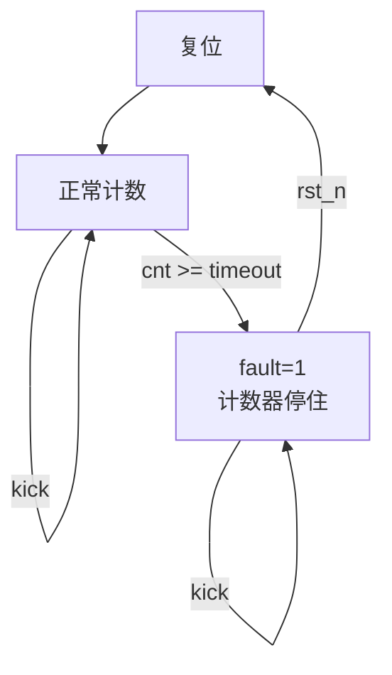

# safety_wdt — 安全看门狗

> 遵循 `.claude/skills/shared/ModuleDocContract.md`。
> 源文件：`fpga/rtl/safety_wdt.v` · Testbench：`fpga/tb/tb_safety_wdt.sv`

---

## 1. Module Overview

监视"上层还活着吗"：上层必须周期性给一个 `kick` 脉冲。超过 `timeout_ms` 没喂，
模块拉高 `fault` 并把 `pwm_en` 拉低，**直接切断电机 PWM**。

它是赛题得分点「**AI 异常时底层安全控制仍保持有效**」的落地点。
架构底线：**AI 只能给速度指令，不能直接碰 PWM**——中间隔着这个模块。

```
边缘 AI ──(速度指令 + 心跳 kick)──→ safety_wdt ──(pwm_en)──→ pwm_gen ──→ 电机
            心跳断 200 ms 后 ────────────────────────┘ 拉低，停车
```

---

## 2. Parameters

| Parameter | Default | Legal Range | Description |
|---|---|---|---|
| `CLK_HZ` | 50_000_000 | **必须能被 1000 整除** | 时钟频率。用于把 `timeout_ms` 换算成周期数 |
| `RS_LV` | 0 | 0 / 1 | 复位有效电平，0 = 低有效（项目默认） |

> `CLK_HZ` 不能被 1000 整除时换算是整数除法，**阈值会有误差且不报错**。
> 50 MHz / 60 MHz 都没问题；奇怪的频率请自己先算一遍。

---

## 3. Ports

| Name | Direction | Width | Reset Value | Description |
|---|---|---|---|---|
| `clk` | input | 1 | — | 系统时钟 |
| `rst_n` | input | 1 | — | 复位，极性由 `RS_LV` 决定 |
| `kick` | input | 1 | — | **单周期脉冲**：喂狗。必须周期性给 |
| `timeout_ms` | input | 16 | — | 超时阈值（毫秒）。**0 = 立即触发**（见 §10） |
| `fault` | output | 1 | `0` | 高 = 已超时。**锁存，只能靠复位清除** |
| `pwm_en` | output | 1 | `1` | `~fault`。直接串到 `pwm_gen` 的 `en` |

---

## 4. Interface Protocol

无总线、无握手，全部独立信号。

- `kick` 必须是**单周期脉冲**。持续拉高不会更有效，只会让计数器一直停在 0。
- `fault` / `pwm_en` 是持续有效的寄存器输出（组合自 `fault`，无毛刺）。
- **喂狗周期必须 < `timeout_ms`**，且要留余量。若上层按 100 ms 喂、阈值也是 100 ms，
  抖动一大会误触发。**建议阈值 ≥ 喂狗周期的 2 倍**（当前约定：20 ms 喂 / 200 ms 阈值）。

---

## 5. Reset Behavior

- **同步复位**（`always @(posedge clk)`），判据是 `rst_n == RS_LV`。
- 复位时 `fault <= 0`、`cnt_ff <= 0`、`pwm_en` 随之回到 1。
- **复位是清除 `fault` 的唯一途径。**

---

## 6. Timing Characteristics

| 项 | 值 |
|---|---|
| 时钟域 | 单时钟域 |
| `kick` → 计数器归零 | 1 个 `clk` 周期 |
| 停止喂狗 → `fault` 拉高 | `timeout_ms` × `CLK_HZ/1000` 个周期（±2 拍） |
| `fault` → `pwm_en` 拉低 | **同拍**（组合），无额外延迟 |
| 吞吐 | 无 |

**实测**（`CLK_HZ=1000`，即 1 拍 = 1 ms）：阈值 10 → 12 拍后 `fault`；阈值 5 → 7 拍后 `fault`。

---

## 7. Functional Description

一个计数器 + 一个锁存位：

- 每拍 `cnt_ff` 加 1；收到 `kick` 就归零。
- `cnt_ff >= timeout_cyc` → `fault <= 1`，**计数器停在原地**（不再自增）。
- `fault` 一旦为 1，**只有复位能清**。

### 为什么计数器不再自增

继续数会**回绕**（32 位绕回来）。回绕之后再比较大小就会出错——
故障会变成"时有时无"。停在阈值上则永远满足比较条件。见 §10.3。

---

## 8. Algorithm



**`F -->|kick| F` 这条自环就是"不自恢复"** —— 本模块最重要的特性。

---

## 9. Register Map

不适用。

---

## 10. Usage Constraints

### 10.1 ⭐ `fault` 不自恢复，这是故意的

故障后即使上层恢复正常、继续喂狗，`fault` **也不会清除**，只能复位。

**为什么**：自动恢复的看门狗会把"持续故障"变成"**周期性抽搐**"——
车每 200 ms 动一下。这**比干脆停住更危险**：既有动力、又不可控，
而且现场看起来"车在动、应该是好的"，会误导排障。

> 上层若想在故障后恢复，必须**显式复位**（或走一个明确的 re-arm 流程）。
> 显式动作比隐式自愈安全。

### 10.2 `timeout_ms = 0` → 立即触发（fail-safe）

阈值算成 0 时，看门狗在**下一拍就报故障**，而不是永不触发。

> **一个配错了就静默失效的看门狗，等于没有看门狗。**
> 宁可停车，不可假装安全。

### 10.3 阈值只能在"未故障"时改

故障期间 `timeout_ms` 变化不会清除 `fault`；但若把阈值**改大**，
计数器会从停住的地方继续数上去、再次满足条件——`fault` 保持 1，无副作用。
把阈值**改小**则立即满足条件，同样无副作用。

### 10.4 计数器宽度

阈值最大 65535 ms × 50000 = 3.28e9 < 2^32，32 位足够，**不会溢出**。
若把 `CLK_HZ` 提到 60 MHz 以上且 `timeout_ms` 用满，需要重新核算。

---

## 11. Instantiation Template

```verilog
safety_wdt #(
    .CLK_HZ (50_000_000),
    .RS_LV  (0)
) u_wdt (
    .clk        (clk),
    .rst_n      (rst_n),
    .kick       (ai_heartbeat),
    .timeout_ms (16'd200),
    .fault      (wdt_fault),
    .pwm_en     (wdt_pwm_en)
);
```

**接入 `pwm_gen`：**

```verilog
pwm_gen #(...) u_pwm (
    .clk   (clk),
    .rst_n (rst_n),
    .en    (user_pwm_en & wdt_pwm_en),   // ← 看门狗直接串进使能
    ...
);
```

---

## 附：验证记录

| 项 | 值 |
|---|---|
| **被验证的 commit** | 见提交（RTL + TB 同提交） |
| 仿真器 | iverilog **v12.0**（`C:\iverilog\bin\`），`-g2012` |
| 日期 | 2026-09-25 笔记本侧 |
| 结果 | **PASS**，8 组用例全过 |
| 综合 / 上板 | ⬜ 未做（笔记本无 Gowin 授权） |

### 反向验证（故意改错 RTL，确认 TB 抓得住）

| 变异体 | 结果 |
|---|---|
| `w2_pwm_never_cut`（`pwm_en` 恒 1，不切断） | ✅ 2 项 FAIL |
| `w3_pwm_inverted`（`pwm_en = fault` 反相） | ✅ 4 项 FAIL |
| `w1c_true_auto_recover`（拆掉优先级闸门 + `kick` 清 `fault`） | ✅ 2 项 FAIL（正是用例 `[4]`） |
| `w1`（仅把 `else if (fault)` 换成 `1'b0`） | ⚪ PASS —— **等价变异体**，见下 |
| `w1b`（仅让 `kick` 顺带清 `fault`） | ⚪ PASS —— **等价变异体**，见下 |

> **⚠️ 两个"变异体"其实是等价的，都 PASS 得正确。** 造变异体本身也要小心：
>
> - `w1` 拆掉了锁存分支，但 `fault` 是寄存器、**没有任何分支给它写 0** → 照样锁存。
> - `w1b` 让 `kick` 清 `fault`，但 `else if (fault)` 的**优先级高于 `kick`** →
>   故障期间 `kick` 分支根本不执行，清不到。
>
> 两处**同时**改（`w1c`）才做出真正的自恢复行为，TB 立刻抓住。
>
> **顺带确认了一件事**：`else if (fault)` 那个分支不是冗余——它是**优先级闸门**，
> 正是它保证了「故障期间喂狗无效」。删掉它、又没有别的地方写 0，行为才等价。
